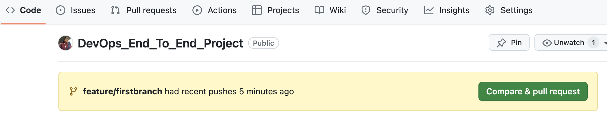

# DevOps End To End Project
DevOps End to End Project using Google Cloud, Terraform

# Steps
## 1. Create GH Repo
Firstly will start with creating the GH Repo say "DevOps_End_To_End_Project".
While creating the repo, make sure to add "README" file and optionally add gitignore file, for this I am adding w.r.t Terraform.

## 2. Personal Access Token
Personal access tokens are an alternative to using passwords for authentication to GitHub when using the GitHub API or the command line. Personal access tokens are intended to access GitHub resources on behalf of yourself.
[Read more here](https://docs.github.com/en/authentication/keeping-your-account-and-data-secure/managing-your-personal-access-tokens)

### How to Generate a Personal Access Token (PAT)
Creating Personal Access Tokens in GitHub is straightforward:

1. Click your portfolio button on any page in GitHub, then press the Settings button.
2. Navigate to `Developer Settings` > `Personal access tokens` > `Tokens (classic)`.
3. On the screen that loads, click the Generate new token button, give your token a name, and configure the expiration period for the token.
4. Configure which scopes to assign to the token. Basically, they are the specific types of permissions that the token should allow a user to perform.
For this will consider `repo` and `workflow`.
5. When the configuration process is complete, click the Generate token button to activate your new token.
6. make a note of the PAT.

## 3. Clone to local workspace.
Clone the GH Repo to your working space.

## 4. Working in a Branch.
Run the command either in GitBash or in Terminal / command prompt by navigating to the path of your repo where you have cloned the repo.

`git branch` This will tell what branch you are, for first time will will display as `* main` as its the main branch.

Lets create a branch as **firstbranch** using command `git checkout -b feature/firstbranch`

## 5. Folder Structure 
Lets working on the folder structure starting with the Workflow, for this cretae a folder as `.github` and subfolder as `workflows`. Those `workflow` directory will contains all the pipeline files.

Next will create a `infra` directory for all infrastructure as a code using Terraform.

Create few files inside it as `main.tf`, `provider.tf`, `backend.tf`, etc.

Make sure while writing the TF backend first create a GCS Bucket for TF State File, and use the same in `backend.tf`. 

Note: There are other ways, I have choose to go with this way.

**Why we need to have backend for Terraform?**

The reason why we need backend for Terraform: if I run my pipeline it is hosted by GH itself, I do not have control over that machine where all the jobs will be running. I need to have the state file intact in some storage or somethign which should be accieesible later on whenever I run another pipeline or may be from another sources. 

So lets go to Google Cloud Console > Cloud Storage > Create a Unique Bucket. Rest of the config for Bucket can be default for now, feel free to add more config as required.

Next will create a folder as `data` for storing any source data files, and `src` for all the code which we build for processing or application source code written in any programming language, here I am using Python.

## 6. Now its time to Code
Before we start coding lets create a Virtual Environment.

To create a virtual environment, go to your project’s directory and run the following command. This will create a new virtual environment in a local folder named .venv:
```
python3 -m venv .venv
```
Activate a virtual environment
```
source .venv/bin/activate
```
To confirm the virtual environment is activated, check the location of your Python interpreter:
```
which python
```
To deactivate a virtual environment
```
deactivate
```

Next is to create a Python Code which will pick the file and upload to Google Cloud Storage Bucket as defined in the code.
[Refer Python Code to Upload File](/src/PythonCode/gcsUpload.py)

Also add the TF code in [main.py](/infra/main.tf) to create a storage bucket in GCP, will reference this bucket in above Python code to place the file.

Make sure to create a Service Account which will be used to authenticate the TF to spin up the resources on behalf of us in GCP, and run the GitHub Actions.

Say Service Account as "myproject-tf-ghwf-sa".

Create a Key for this Service Account, and download it. The file will be in json format and multi-line, will make it to single line.
One of the option is to use linux command as `cat keys.json | tr -s '\n' ' '`

Now we have to store the keys secetrely because this is very sesitive information. For this navigate to GitHub. `github > Settings > Secrets and variables > Actions > New repository secret` provide the name "SECRET_JSON_GCP_KEY" and paste the key which we converted to single line above, and add secret.

All set for the access, and now work on writing the code for [GH Workflows](/.github/workflows/cicd_pipeline_workflow.yml)

Basic coding is completed. Now lets check the git status.

```
git branch

git status

git add .

git commit -m "feat: adding basic coding and setup GH workflow"

git push -u origin feature/firstbranch

# or just
git push

# For above you may need the PAT token, copy and paste in terminal to proceed if requested.

```

Next is to navigate to GitHub web browser, and you will see something similar as below indicating "... had recently pushes x seconds agaon".


Go and verify the Workflow Pipeline in "Actions" tab.

This will ensure that the workflow started for the branch as well, and executed the steps for terraform init and plan, and skipped the terraform apply & python upload, as for these two we set the rule to trigger only for main branch.

Once verified, click on "Compare & pull request" followed with the "Merge pull request", this will also trigger the workflow pipeline, so verify it as well. As this time we have merged the changes into main branch, we should see the other two steps are also executed.


